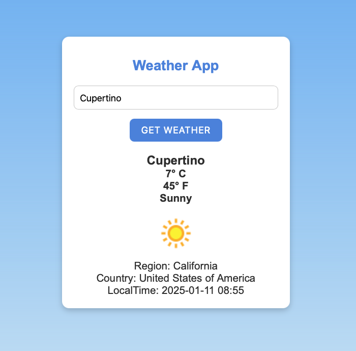
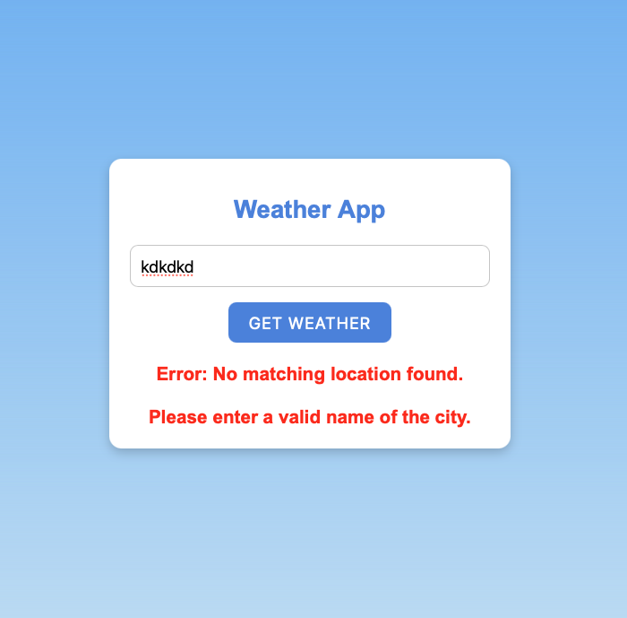

# Weather App

A simple and elegant weather application which allows users to check the current weather details by entering the name of a city.

Access the application here: [https://myweathercheck.netlify.app/](https://myweathercheck.netlify.app/)


## Features

- **City-based Weather Search**: Enter the name of a city to fetch weather details.
- **Current Weather Details**: Displays temperature and weather conditions (e.g., sunny, cloudy, rainy).
- **Additional Information**: Shows the country name, region name, and local time for the entered city.
- **Input Validation**: Ensures the entered city name is valid.

## Technologies Used

- **HTML**: Structure and layout of the app.
- **CSS**: Styling for a clean and user-friendly interface.
- **JavaScript**: Core functionality to fetch and display weather details dynamically.

## How It Works

1. The user enters a city name in the input field.
2. The app validates the input.
3. A weather API is called to fetch real-time weather data for the entered city.
4. If the city name is valid, the app displays:
   - Temperature
   - Weather conditions (e.g., sunny, rainy)
   - Country name
   - Region name
   - Local time
5. If the city name is invalid, an error message is displayed.

## Snippets
*Showing weather for Cupertino, California*



<br>

*Error message is diplayed below upon looking for an invalid city name*




## Installation

1. Clone the repository:

   ```bash
   git clone https://github.com/LeadGeekSquad/WeatherCheck
   ```

2. Navigate to the project directory:

   ```bash
   cd WeatherCheck
   ```

3. Open `weather.html` in your preferred web browser.

## API Integration

- **Weather API**: The app uses a weather API to fetch the data. Make sure to replace `YOUR_API_KEY` in the JavaScript file with your actual API key.

## Folder Structure

```
weather-app/
├── weather.html       # Main HTML file
├── weather.css        # CSS file for styling
├── weather.js         # JavaScript file for functionality
└── README.md          # Documentation (this file)
```

## Usage

1. Open the app in a browser.
2. Enter the name of a city in the input field and press the get weather button.
3. View the weather details, including temperature, weather conditions, country name, region name, and local time.
4. For invalid city names, an error message will guide you to correct the input.


## Contribution

Contributions are welcome! 
Feel free to contribute to this project by submitting issues or pull requests. Your feedback and ideas are greatly appreciated!
If you'd like to improve this app or add features, follow these steps:


1. Fork the repository. [Link to the repository](https://github.com/LeadGeekSquad/WeatherCheck).

2. Create a new branch:
   ```bash
   git checkout -b feature-name
   ```
3. Commit your changes:
   ```bash
   git commit -m "Add your message here"
   ```
4. Push to the branch:
   ```bash
   git push origin feature-name
   ```
5. Open a pull request.


